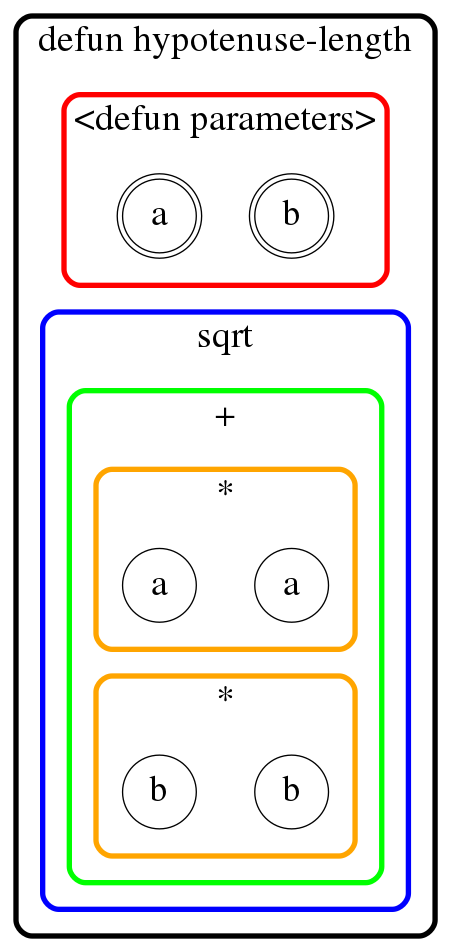
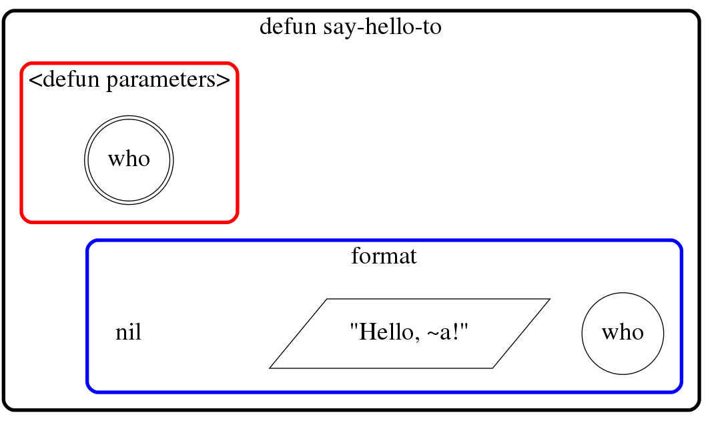
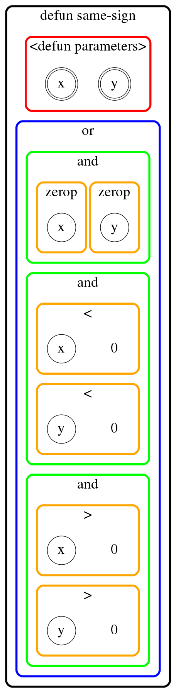

# lisplay

### Visualisation tool to display lisp code as nested clusters (parentheses free!)

:pushpin: **Currently under development and not yet usable, but the
details below outline the basic aspiration for this project.** :pushpin:


## About

`lisplay`: **lisp** disp**lay**, or **lisp** **lay**out.

The aim of `lisplay` is to visualise lisp (initially Common Lisp only,
though perhaps other variants eventually, or even in a variant-agnostic way)
code in its programmatic form without parentheses, in the form of nested
clusters of simple shapes.

Notably, **boxes represent S-expressions**, where boxes inside other boxes
represent S-expressions which are elements of the outer S-expression,
according to a left-to-right and top-to-bottom visual ordering of elements
corresponding to lisp S-expression parsing order.

Moreover:

* **atoms** are depicted in **plain text** with no surrounding shape (to
  emphasise their primitive nature);
* **built-in keywords and predicates** are also indicated in plain text with
  no surrounding shape, but additionally they are positioned at the top
  of the box (cluster) to highlight their importance;
* **function parameters** are represented by double-enclosing circles when
  specified as function parameters of the `defun` macro and as (single)
  circles when used in the function body definition;
* **strings** are depicted within **parallelograms**.

Colours are used to distinguish between boxes representing different
S-expressions and levels of nesting of these.


## Why?

This project was started mainly as a way for me to improve my ability in
in Common Lisp and Graphviz/DOT, but I hope that the resulting visualisations
may be useful to others for understanding, and perhaps debugging or
prorotyping, lisp code. As such, it could be useful as an educational and/or
conceptual tool.


## Requirements

`lisplay` uses [Graphviz](https://graphviz.org/) and its associated
[DOT graph description language]()
to define and display its visualisations (lisp code is ultimately converted
to a graph defined in DOT language). Therefore Graphviz is a dependency,
as well as [`CL-DOT`](https://github.com/michaelw/cl-dot)
for translating intermediate lisp code representing the
source lisp code into DOT code that can be rendered by Graphviz.

See the examples below for an indication of the outputs, though note that
the precise design of the visualisations has not yet been finalised and
may change.


## Examples

The directory `examples-as-tests` holds example trivial Common Lisp functions
and their DOT representation, as well as the resulting visualisations in
PNG format generated from the DOT files. The visualisations there can be
viewed, and were saved, by commands such as the following:

```console
$ cd examples-as-tests/defun-examples/
$ xdot hypotenuse-length.dot  # view visualisation
$ dot hypotenuse-length.dot -Tpng -o hypotenuse-length.png  # create PNG image
```

### Example 1: function for hypotenuse length

Take a basic function to encapsulate Pythagoras' Theorem:

```common-lisp
(defun hypotenuse-length (a b)
  "HYPOTENUSE-LENGTH gives the hypotenuse length for a right-angled triangle."
  (sqrt (+ (* a a)
           (* b b))))
```

`lisplay` would visualise this as:




### Example 2: function to say hello

This simple function uses a string and a `nil` symbol:

```common-lisp
(defun say-hello-to (who)
  "SAY-HELLO-TO returns a string which greets whoever is named by parameter."
  (format nil "Hello, ~a!" who))
```

and `lisplay` would visualise it as:



### Example 3: function to check if inputs have the same sign

This trivial function (taken from David S. Touretzky's
[book](https://www.cs.cmu.edu/~dst/LispBook/book.pdf)
'COMMON LISP: A Gentle Introduction to Symbolic Computation') has
a more complex structure in terms of number and nesting of S-expressions
than the previous examples:

```common-lisp
(defun same-sign (x y)
  "SAME-SIGN predicate tests if its two inputs have the same sign."
  (or (and (zerop x) (zerop y))
      (and (< x 0) (< y 0))
      (and (> x 0) (> y 0))))
```

It would be visualised by `lisplay` as follows:


